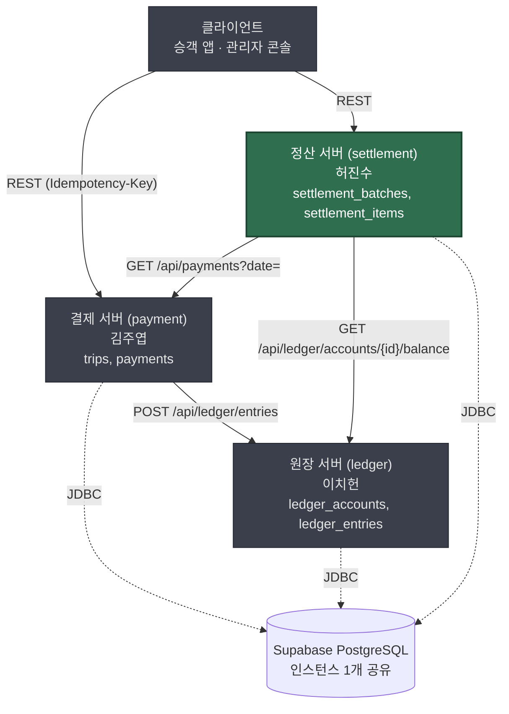

> [📚 문서 목록](../README.md) › [📄 요구사항 기술서](./index.html) › §1~§2

# 📄 문서 개요와 시스템 개요

| 항목 | 값 |
|---|---|
| 대상 시스템 | 운전자 정산 시스템 (`driver-settlement-system`) |
| 담당자 | 허진수 |
| 작성일 | 2026-08-10 |
| 상태 | 초안 — 🚧 표시 항목은 **08.11(화) 중간 회의**에서 확정 |
| 상위 출처 | `core-documents/01-planning/service-spec.md` §1~§3.4 (확정 기획서) |

---

## 1. 문서 개요

### 가. 목적

이 문서는 **정산 서버가 무엇을 왜 해야 하는지**를 서술한다. 
상위 기획서(`service-spec.md`)는 결제·원장·정산 세 도메인을 한꺼번에 다루므로, 정산 서버 담당자가 구현에 착수하기에는 경계와 책임이 흐리다. 
이 문서는 그 중 **정산 서버**의 몫만 떼어내 서술형으로 정리한 것이다.

검증 가능한 항목 단위로 분해한 것은 [요구사항 정의서](../02-requirements-specification/index.html)이며, 이 문서는 그 앞단의 **"배경과 서술"** 에 해당한다.

### 나. 범위

**정산 서버(`driver-settlement-system`) 하나**를 대상 시스템으로 삼는다. 
결제 서버·원장 서버는 정산 서버가 API로 호출하는 **외부 시스템**으로만 등장하며, 그 내부 구현·요구사항은 이 문서가 규정하지 않는다.

> 결제 서버는 김주엽, 원장 서버는 이치헌이 소유한다. 
> 각 서버의 API·테이블에 대한 결정권은 소유자에게만 있다 (`core-documents/00-team/roles.md`). 
> 이 문서에서 두 서버를 언급하는 부분은 전부 **"정산 서버가 그들에게 무엇을 기대하는가"** 이며, 그들이 무엇을 해야 하는가가 아니다.

### 다. 독자

- 정산 서버 구현자 (허진수)
- 결제·원장 서버 담당자 (정산이 자기 API에 무엇을 기대하는지 확인용)
- 중간·최종 발표 청중

### 라. 관련 문서

| 문서 | 역할 |
|---|---|
| [`core-documents/01-planning/service-spec.md`](https://github.com/Easy-ADJ/core-documents/blob/main/01-planning/service-spec.md) | 확정 기획서. §1~§3이 요구사항 원천. **§4 아키텍처는 현행 아님** |
| [`core-documents/02-design/architecture.md`](https://github.com/Easy-ADJ/core-documents/blob/main/02-design/architecture.md) | **현행 아키텍처 단일 출처** |
| [`core-documents/02-design/service-contracts.md`](https://github.com/Easy-ADJ/core-documents/blob/main/02-design/service-contracts.md) | 서버 간 호출 계약, 테이블 직접 접근 금지 규칙, 공통 규약 |
| [`core-documents/02-design/erd.md`](https://github.com/Easy-ADJ/core-documents/blob/main/02-design/erd.md) | 테이블 소유권·주요 제약 |
| [`core-documents/02-design/services/settlement.md`](https://github.com/Easy-ADJ/core-documents/blob/main/02-design/services/settlement.md) | 정산 서버 설계 초안 (이 문서의 직접 상위) |

---

## 2. 시스템 개요

### 가. 전체 맥락 (배경)

EasyADJ는 지역 기반 모빌리티 플랫폼 "D-Move"의 정산 파이프라인이다. 
서버 3개가 도메인별로 나뉘어 있고, DB는 **Supabase 또는 AWS Aurora PostgreSQL 인스턴스 하나**를 공유한다.

> **의존 방향은 결제 → 원장, 정산 → (결제, 원장)이다.** 정산 서버는 세 서버 중 의존이 가장 많다. 
> 결제·원장 API가 확정되기 전에는 본격 구현이 불가능하므로, 개발 순서상 마지막에 몰릴 위험이 구조적으로 존재한다.

### 나. 정산 서버의 역할

정산 서버는 **하루가 끝난 뒤 그날의 결제 내역을 기사별로 묶어 지급액을 계산하고, 그 계산 근거를 남기며, 원장과 대조해 맞는지 확인한다.**

아래와 같이 3가지 일을 한다.

1. **집계**: 매일, 전일 완료된 결제를 기사별로 합산해 운임의 80%를 지급액으로 산출 (수수료 20% 차감)
2. **추적 가능한 기록**: "이 기사의 이 금액은 어떤 운행 건들에서 나왔는가"를 항목 단위로 기록
3. **대사**: 원장의 기사 미지급금 잔액과 정산 항목 합계가 일치하는지 검증

---

**다음** → [해결하려는 문제](./02-problem.md)
