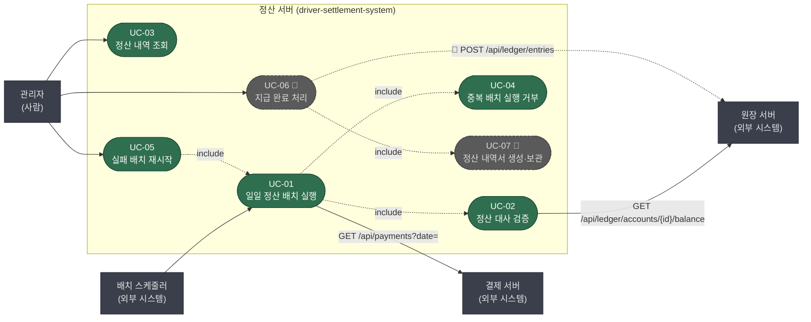

> [📚 문서 목록](../README.md) › [🎭 유스케이스 다이어그램](./index.html) › §1

# 🎭 유스케이스 다이어그램

표기 관례는 [§0](./00-notation.md)을 따른다.

**읽는 법**

- `UC-01`이 `UC-04`(중복 거부)와 `UC-02`(대사)를 include한다 — 배치를 돌리면 사전검사와 대사가 항상 함께 일어난다. 별개로 실행하는 기능이 아니다.
- 결제·원장 서버는 **정산 서버가 호출하는 대상**이므로 화살표가 시스템에서 밖으로 나간다. 두 서버는 정산 서버를 호출하지 않는다.
- 기사는 이 다이어그램에 없다. 정산 서버를 직접 쓰지 않는다 — 문의 시 관리자가 `UC-03`으로 답한다. **`UC-03`이 존재하는 이유가 기사다.**

---

**이전** → [표기 관례](./00-notation.md) · **다음** → [UC-01 일일 정산 배치 실행](./02-uc-01-batch-execution.md)
