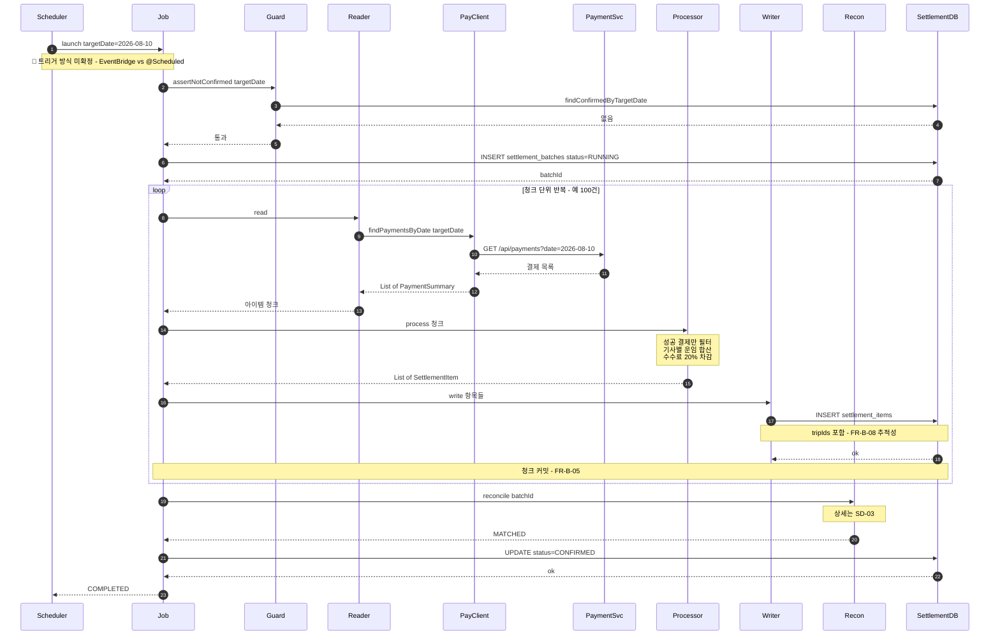

> [📚 문서 목록](../README.md) › [🔀 시퀀스 다이어그램](./index.html) › SD-01

# 🔁 SD-01 — 정산 배치 정상 흐름

대응: [`UC-01`](../03-use-case-diagram/02-uc-01-batch-execution.md) / `FR-B-01`~`FR-B-05`, `FR-B-08`, `FR-S-01`, `NFR-06`

참여자 정의는 [§0 등장 요소](./00-participants.md)에 있다.

**짚어둘 점**

- **`RUNNING` 레코드는 사전검사를 통과한 뒤에 만든다** (4~6단계 순서). 거부된 실행이 흔적을 남기지 않게 하려는 의도다 ([`UC-04` D1](../03-use-case-diagram/05-uc-04-duplicate-rejection.md)).
- 청크 커밋이 루프 안에 있다. Job 전체가 하나의 트랜잭션이 아니므로, 도중에 실패해도 이전 청크 결과는 DB에 남는다 (`FR-B-05`, [`UC-01` A5](../03-use-case-diagram/02-uc-01-batch-execution.md)).
- 대사는 **모든 청크가 끝난 뒤 한 번** 수행한다. 청크마다 대사하면 원장 잔액이 계속 변하는 중간 상태와 비교하게 된다.
- `Reader`는 `PayClient`만 알고 HTTP를 모른다. 반대로 `PayClient`만 URL·타임아웃·재시도를 안다.

---

**이전** → [등장 요소](./00-participants.md) · **다음** → [SD-02 중복 실행 거부](./02-sd-02-duplicate-rejection.md)
