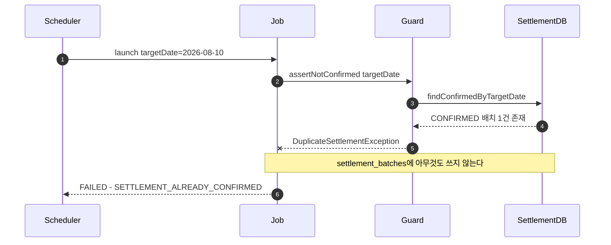

> [📚 문서 목록](../README.md) › [🔀 시퀀스 다이어그램](./index.html) › SD-02

# 🚫 SD-02 — 중복 실행 거부

대응: [`UC-04`](../03-use-case-diagram/05-uc-04-duplicate-rejection.md) / `FR-B-06`, `NFR-01`

**짚어둘 점**

- 거부는 **Job 시작 전**에 일어난다. 시작한 뒤 롤백하는 방식이 아니다 — 중간까지 쓴 데이터가 남을 여지를 없애기 위해서다.
- `FAILED` 배치만 있으면 통과시킨다. 실패한 배치는 재실행 대상이다 ([`UC-05`](../03-use-case-diagram/06-uc-05-failed-restart.md)).
- ⚠️ **이 사전검사는 동시 실행 경합을 막지 못한다.** 두 프로세스가 3~4단계를 동시에 통과할 수 있다. `settlement_batches`에 부분 UNIQUE 인덱스(`WHERE status='CONFIRMED'`)를 두는 것을 권한다 ([정의서 §6.1](../02-requirements-specification/05-data-requirements.md), [`UC-04` D4](../03-use-case-diagram/05-uc-04-duplicate-rejection.md)). 결제 서버의 `idempotency_key` UNIQUE가 하는 역할을 정산에서는 이 제약이 해준다.

---

**이전** → [SD-01 정산 배치 정상 흐름](./01-sd-01-batch-normal-flow.md) · **다음** → [SD-03 대사 검증](./03-sd-03-reconciliation.md)
