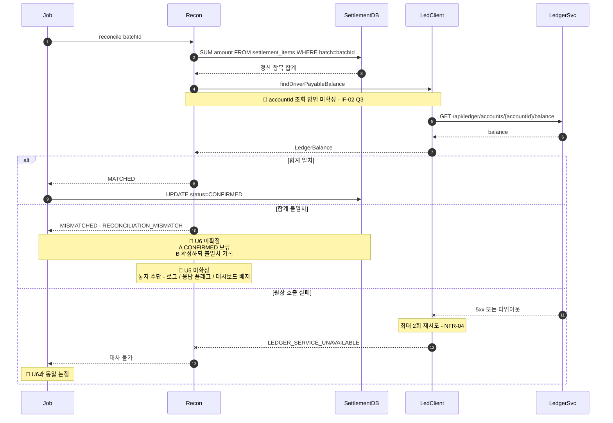

> [📚 문서 목록](../README.md) › [🔀 시퀀스 다이어그램](./index.html) › SD-03

# ⚖️ SD-03 — 대사 검증

대응: [`UC-02`](../03-use-case-diagram/03-uc-02-reconciliation.md) / `FR-R-01`~`FR-R-04`

**짚어둘 점**

- `Recon`은 `ledger_entries`를 SUM하지 않는다. 원장 API로만 잔액을 얻는다 (`FR-R-02`). 잔액 계산 로직이 두 서버에 중복되면 어느 쪽이 맞는지 판단할 근거가 사라진다.
- ⚠️ **절사·반올림 규칙(U12 / `FR-B-12`)이 원장과 다르면 이 `alt`의 두 번째 분기가 상시 발생한다.** 계산과 저장이 모두 정상인데 대사만 실패하는 상황이며, 원인 파악이 가장 어려운 유형이다. 원장 담당자와의 합의가 이 다이어그램의 선행 조건이다.
- 세 번째 분기(원장 호출 실패)와 두 번째 분기(불일치)는 **다른 상황**이다. 전자는 "모르겠다", 후자는 "틀렸다"다. 같은 처리로 묶지 않는 편이 좋다.

판정 로직의 분기 조건은 [`FC-03`](../05-flow-chart/03-fc-03-reconciliation-decision.md)에 있다.

---

**이전** → [SD-02 중복 실행 거부](./02-sd-02-duplicate-rejection.md) · **다음** → [SD-04 결제 서버 장애 시 Reader 실패](./04-sd-04-payment-service-failure.md)
