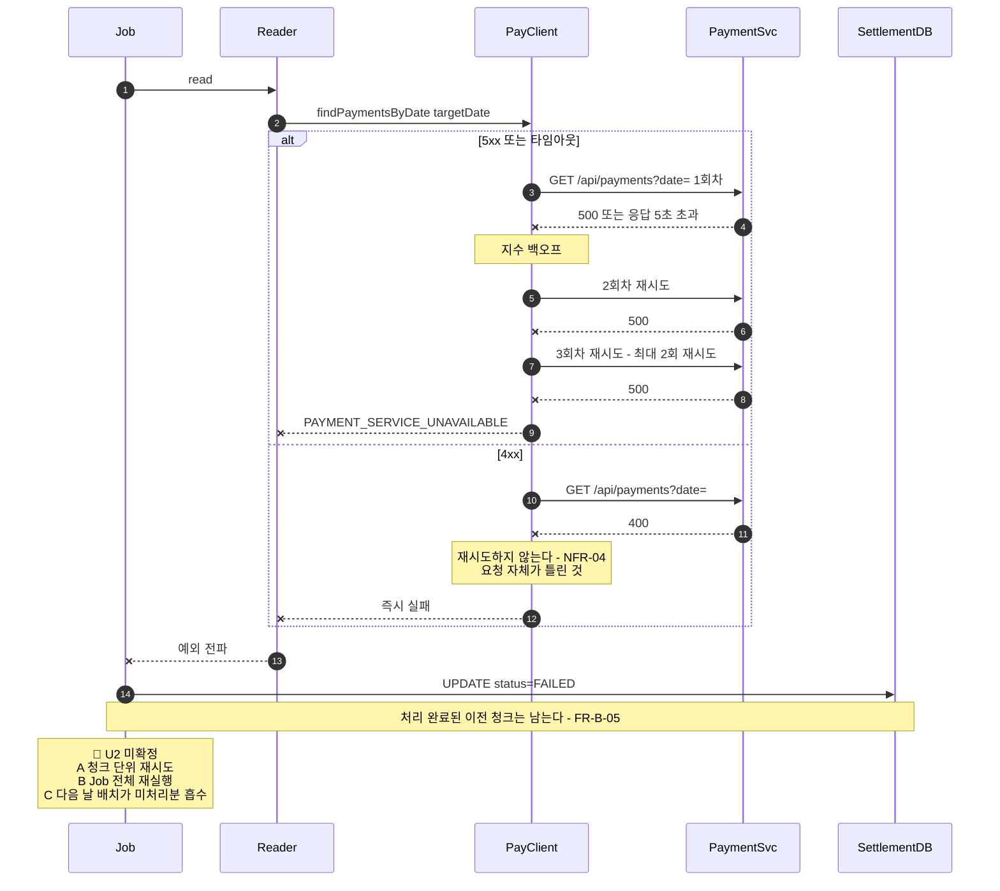

> [📚 문서 목록](../README.md) › [🔀 시퀀스 다이어그램](./index.html) › SD-04

# 💥 SD-04 — 결제 서버 장애 시 Reader 실패

대응: [`UC-01` A2·A3](../03-use-case-diagram/02-uc-01-batch-execution.md) / `IF-01`, `FR-B-10` 🚧, `NFR-03`, `NFR-04`

**짚어둘 점**

- 이 시나리오는 **서버 분리로 새로 생긴 실패 지점이다.** 단일 서버였다면 Reader가 DB를 조회해 끝날 일이었다. 이제 결제 서버가 죽으면 정산 배치가 통째로 실패한다.
- `NFR-04`의 4xx 비재시도가 실질적으로 중요한 이유가 여기서 드러난다. 400이 오는 상황(예: 날짜 형식 오류)은 재시도해도 같은 400이 온다. 재시도는 시간만 쓴다.
- 🚧 U2가 확정되지 않은 동안은 `FAILED` 처리 후 [`UC-05`](../03-use-case-diagram/06-uc-05-failed-restart.md)(수동 재시작)가 유일한 복구 경로다. 데모까지는 이것으로 충분하나, 문서상 공백임을 인지한다.

---

**이전** → [SD-03 대사 검증](./03-sd-03-reconciliation.md) · **다음** → [SD-05 관리자 정산 내역 조회](./05-sd-05-admin-query.md)
