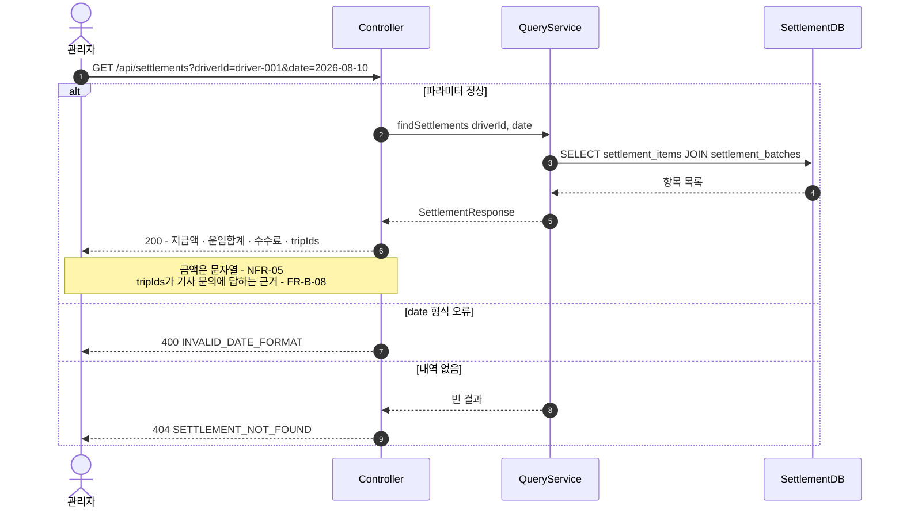

> [📚 문서 목록](../README.md) › [🔀 시퀀스 다이어그램](./index.html) › SD-05

# 🔍 SD-05 — 관리자 정산 내역 조회

대응: [`UC-03`](../03-use-case-diagram/04-uc-03-settlement-query.md) / `FR-Q-01`, `FR-Q-02`, `FR-B-08`, `NFR-05`

**짚어둘 점**

- `SELECT ... JOIN`은 **정산 소유 테이블끼리만** 한다. `trips`를 조인해 운행 상세를 붙이지 않는다 — 필요하면 응답의 `tripIds`를 받은 쪽이 결제 서버에 물어본다 (`CST-02`).
- 응답에 `fareTotal`·`feeAmount`를 함께 담아 "왜 이 금액인가"를 응답만으로 설명한다. 이것이 [§3 문제](../01-requirements-statement/02-problem.md)에 대한 실질적 답이다.
- 🚧 `FR-Q-04` — 결과가 많을 때의 페이지네이션은 미확정이다.

---

**이전** → [SD-04 결제 서버 장애 시 Reader 실패](./04-sd-04-payment-service-failure.md) · **다음** → [🚧 SD-06 정산 확정 시 원장 지급 분개 기록](./06-sd-06-payout-ledger-entry.md)
