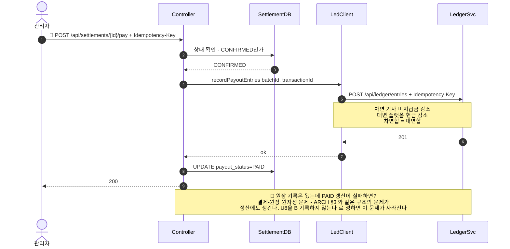

> [📚 문서 목록](../README.md) › [🔀 시퀀스 다이어그램](./index.html) › SD-06

# 🚧 SD-06 — 정산 확정 시 원장 지급 분개 기록

> 🚧 **미확정 (U8 / `FR-S-03`, `IF-03`).** 아래는 "기록한다"를 택할 경우의 흐름이며, 확정된 설계가 아니다.

대응: [`UC-06`](../03-use-case-diagram/07-uc-06-07-pending.md) 🚧

**짚어둘 점**

- **U8을 "기록한다"로 정하면 정산도 원자성 문제를 갖게 된다.** 결제 → 원장에서 논의 중인 문제(`ARCH §3`)와 같은 구조다: HTTP 경계를 넘어 두 개의 쓰기를 원자적으로 묶을 수 없다.
- 실제 송금이 없는 이 프로젝트에서 지급 분개가 정말 필요한지는 회의에서 판단할 문제다. **기록하지 않기로 하면 이 다이어그램 전체가 불필요해진다** — 그게 가장 단순한 선택이다.
- 기록하기로 한다면 원장 API가 `transactionId` 기준으로 멱등해야 한다 (`CTR §2`). 재시도해도 분개가 1세트만 생겨야 한다.

---

**이전** → [SD-05 관리자 정산 내역 조회](./05-sd-05-admin-query.md)
