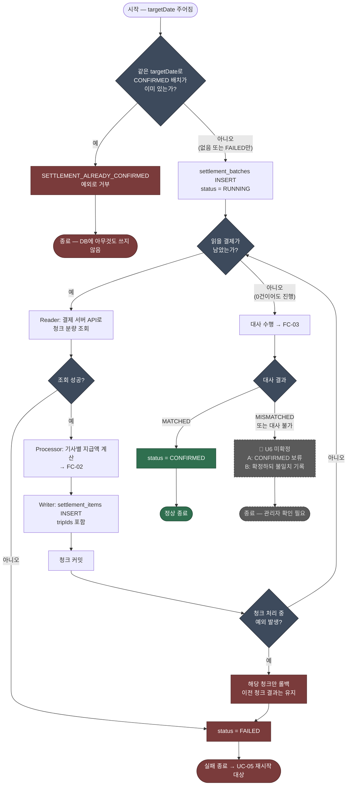

> [📚 문서 목록](../README.md) › [🧭 플로우 차트](./index.html) › FC-01

# 🔁 FC-01 — 정산 배치 Job 제어 흐름

| 항목 | 값 |
|---|---|
| 대상 시스템 | 운전자 정산 시스템 (`driver-settlement-system`) |
| 상위 문서 | [요구사항 정의서](../02-requirements-specification/index.html) · [유스케이스 다이어그램](../03-use-case-diagram/index.html) |
| 상태 | 초안 — 🚧 분기는 **08.15(토) 2차 회의** 후 확정 |

[시퀀스 다이어그램](../04-sequence-diagram/index.html)이 "누가 누구를 부르는가"를 보여준다면, 이 문서는 **"어떤 조건에서 어디로 가는가"** 를 보여준다.

대응: [`UC-01`](../03-use-case-diagram/02-uc-01-batch-execution.md), [`UC-04`](../03-use-case-diagram/05-uc-04-duplicate-rejection.md) / `FR-B-01`~`FR-B-06`, `FR-R-04` 🚧, `FR-S-01`, `NFR-01`

**짚어둘 점**

| # | 내용 |
|---|---|
| 1 | **사전검사가 `RUNNING` 생성보다 앞에 있다.** 거부된 실행은 DB에 흔적을 남기지 않는다 |
| 2 | **`FAILED` 배치만 있으면 통과시킨다.** 실패한 배치는 재실행 대상이다 ([`UC-05`](../03-use-case-diagram/06-uc-05-failed-restart.md)) |
| 3 | **결제 0건이어도 대사·확정으로 진행한다.** "돌렸는데 0건"과 "안 돌렸다"는 구별돼야 한다 ([`UC-01` A4](../03-use-case-diagram/02-uc-01-batch-execution.md)) |
| 4 | **청크 롤백은 배치 전체 롤백이 아니다.** 이전 청크 결과는 남는다. 이것이 `FR-B-07` 실패 재시작의 전제다 |
| 5 | 🚧 대사 실패 분기(U6)가 이 흐름의 유일한 미확정 지점이다. **"지급 대상 금액을 확정할 것인가"** 를 정하는 분기라 임의로 채우지 않는다 |
| 6 | ⚠️ 좌상단 `guard`는 **애플리케이션 검사**다. 두 프로세스가 동시에 통과할 수 있다 ([`UC-04` D4](../03-use-case-diagram/05-uc-04-duplicate-rejection.md)). DB 부분 UNIQUE 인덱스를 함께 두는 것을 권한다 |

---

**다음** → [FC-02 기사별 지급액 계산](./02-fc-02-payout-calculation.md)
