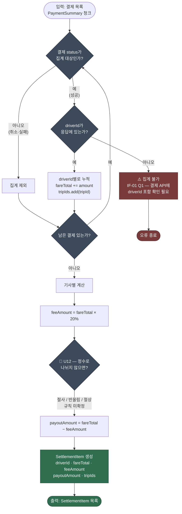

> [📚 문서 목록](../README.md) › [🧭 플로우 차트](./index.html) › FC-02

# 💰 FC-02 — 기사별 지급액 계산

대응: [`UC-01`](../03-use-case-diagram/02-uc-01-batch-execution.md) / `FR-B-03`, `FR-B-08`, `FR-B-12` 🚧, `NFR-05`

`DriverSettlementProcessor` 내부 로직이다.

**계산 예시**

| 기사 | 운행 | 운임 합계 | 수수료 20% | 지급액 80% |
|---|---|---|---|---|
| `driver-001` | `trip-1001`, `trip-1002` | 20,000 | 4,000 | **16,000** |
| `driver-002` | `trip-1003` | 3,333 | 666.6 → 🚧 | 🚧 |

**짚어둘 점**

| # | 내용 |
|---|---|
| 1 | ⚠️ **`driverId` 없으면 이 로직 전체가 성립하지 않는다.** 결제 API 응답에 `driverId`가 없으면 `trips`를 직접 읽어야 하는데 그건 `CST-02` 위반이다. [`IF-01` Q1](../02-requirements-specification/04-external-interfaces.md)을 김주엽에게 먼저 확인해야 한다 |
| 2 | 🚧 **U12(절사·반올림)가 두 번째 예시 행을 채우지 못하게 만든다.** 3,333원의 80%는 2,666.4원이다. 원장과 규칙이 다르면 [`FC-03`](./03-fc-03-reconciliation-decision.md)의 대사가 정상 계산에도 실패한다 |
| 3 | `fareTotal`·`feeAmount`를 함께 저장한다 ([정의서 §6.2](../02-requirements-specification/05-data-requirements.md) 제안). `payoutAmount`만 남기면 수수료율이 바뀐 뒤 과거 정산을 설명할 수 없다 |
| 4 | `tripIds` 누적이 `FR-B-08` 추적성의 실체다. 이 필드가 없으면 [프로젝트의 출발점(§3)](../01-requirements-statement/02-problem.md)이 해결되지 않는다 |
| 5 | 취소 결제 판별 기준은 [`IF-01` Q2](../02-requirements-specification/04-external-interfaces.md) — 결제 API의 `status` 값 목록에 달려 있다 |

---

**이전** → [FC-01 정산 배치 Job 제어 흐름](./01-fc-01-batch-control-flow.md) · **다음** → [FC-03 대사 판정](./03-fc-03-reconciliation-decision.md)
