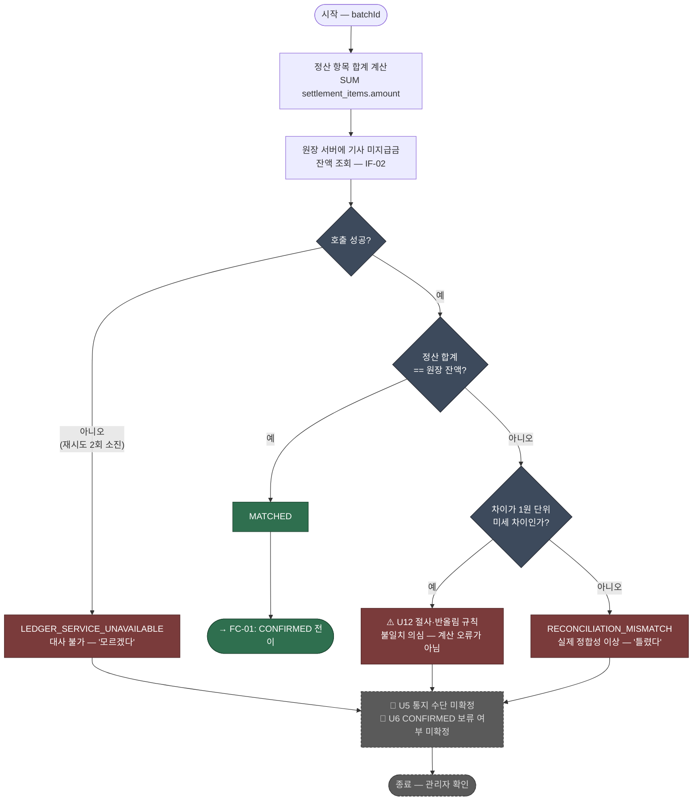

> [📚 문서 목록](../README.md) › [🧭 플로우 차트](./index.html) › FC-03

# ⚖️ FC-03 — 대사 판정

대응: [`UC-02`](../03-use-case-diagram/03-uc-02-reconciliation.md) / `FR-R-01`~`FR-R-04`

**짚어둘 점**

| # | 내용 |
|---|---|
| 1 | **"대사 불가"와 "대사 불일치"는 다르다.** 전자는 원장에 물어보지 못한 것("모르겠다"), 후자는 물어봤는데 답이 다른 것("틀렸다"). 같은 처리로 묶으면 원장 서버 재시작 중에 정합성 경보가 뜬다 |
| 2 | **1원 단위 미세 차이를 별도 분기로 뒀다.** U12가 미해결인 동안 오탐의 주요 원인이므로, 원인 판별에 시간을 덜 쓰기 위해서다. U12가 확정되면 이 분기는 제거한다 |
| 3 | 정산 합계는 정산 소유 테이블에서, 원장 잔액은 API에서 얻는다. 정산이 `ledger_entries`를 SUM하는 경로는 없다 (`FR-R-02`, `CST-02`) |
| 4 | 부호 규약([`IF-02` Q4](../02-requirements-specification/04-external-interfaces.md)) — 미지급금이 양수인지 음수인지 원장과 맞춰야 한다. 잘못 잡으면 `compare`가 항상 불일치로 떨어진다 |

---

**이전** → [FC-02 기사별 지급액 계산](./02-fc-02-payout-calculation.md) · **다음** → [FC-04 정산 배치 상태 전이](./04-fc-04-state-transition.md)
