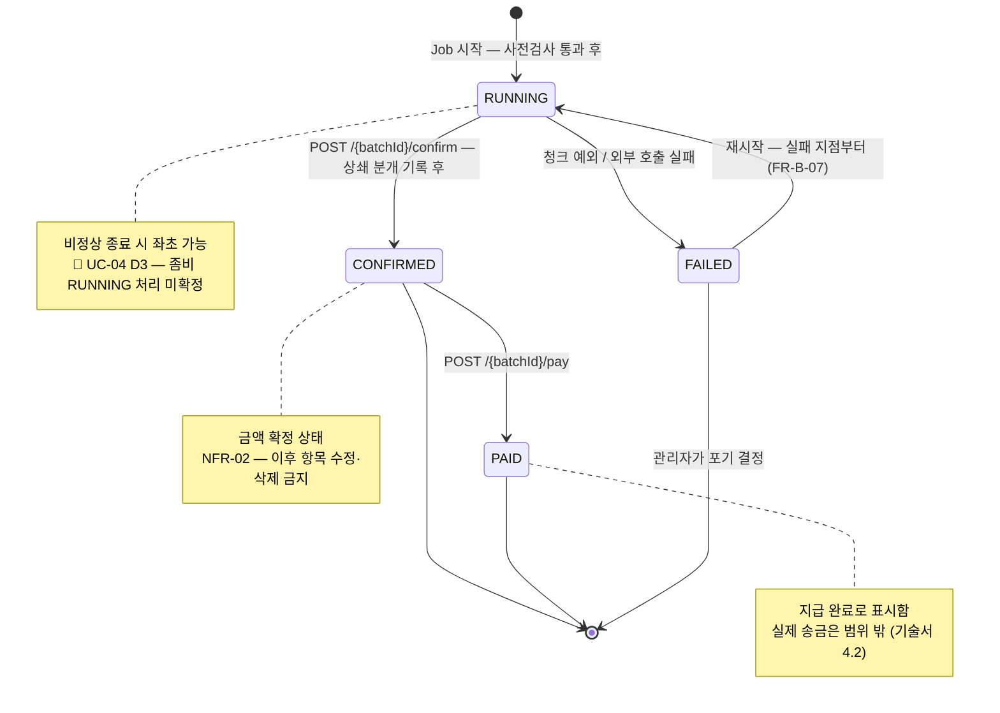

> [📚 문서 목록](../README.md) › [🧭 플로우 차트](./index.html) › FC-04

# 🔀 FC-04 — 정산 배치 상태 전이

대응: [`UC-01`](../03-use-case-diagram/02-uc-01-batch-execution.md), [`UC-05`](../03-use-case-diagram/06-uc-05-failed-restart.md), [`UC-06`](../03-use-case-diagram/07-uc-06-07-pending.md) / `FR-S-01`, `FR-S-02`, `FR-B-07`

**허용되지 않는 전이**

| 시도 | 결과 | 이유 |
|---|---|---|
| `PAID` → `RUNNING` | `INVALID_STATE_TRANSITION` | 지급 완료 표시를 되돌리는 경로를 두지 않는다 |
| `PAID` → `CONFIRMED` | `INVALID_STATE_TRANSITION` | 위와 동일 |
| `CONFIRMED` → `RUNNING` | `INVALID_STATE_TRANSITION` | 확정된 금액을 다시 계산하지 않는다. 정정은 새 배치로 |
| `CONFIRMED` → `FAILED` | `INVALID_STATE_TRANSITION` | 확정 후 실패라는 상태는 없다 |

**짚어둘 점**

| # | 내용 |
|---|---|
| 1 | `FAILED` → `RUNNING`만 되돌아가는 유일한 전이다. Spring Batch 메타 테이블이 실패 지점을 기억하므로 처음부터 다시 돌지 않는다 |
| 2 | 🚧 **좀비 `RUNNING`** — 서버가 배치 도중 죽으면 `RUNNING`이 남는다. 다음 실행이 이를 "진행 중"으로 볼지 "죽은 것"으로 볼지 미확정이다 ([`UC-04` D3](../03-use-case-diagram/05-uc-04-duplicate-rejection.md)). Spring Batch 메타의 Job 실행 상태로 판별하는 방법이 있다 |
| 3 | `FAILED` 배치의 항목을 폐기해도 되는지는 `NFR-02`와 긴장 관계다 ([`UC-05` E2](../03-use-case-diagram/06-uc-05-failed-restart.md)). "확정 전 항목은 폐기 가능"이라는 예외를 명시할지 회의에서 확인한다 |
| 4 | `CONFIRMED`가 이 시스템의 실질적 목표 상태다. `PAID`는 표시일 뿐이며 실제 송금을 뜻하지 않는다 |

전이 규칙을 담는 클래스는 `BatchStatus.canTransitionTo()`다 — [클래스 다이어그램 §2 도메인 계층](../06-class-diagram/02-domain-layer.md).

---

**이전** → [FC-03 대사 판정](./03-fc-03-reconciliation-decision.md)
