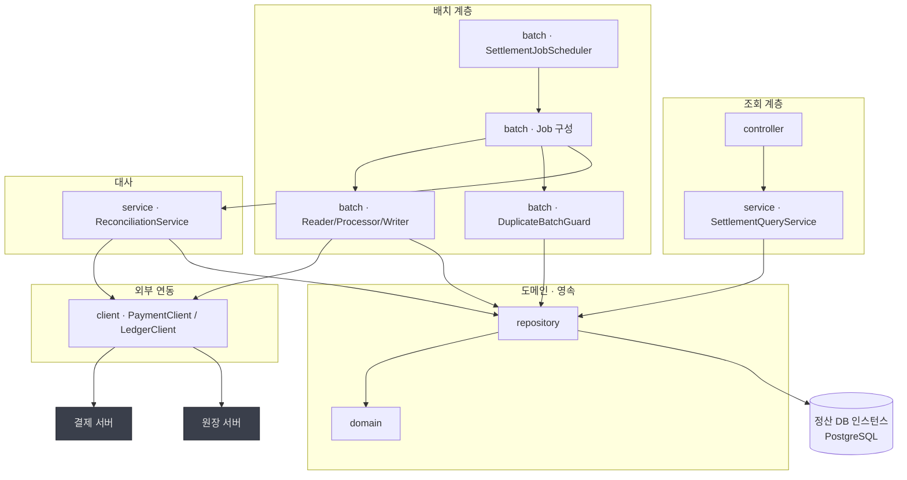

> [📚 문서 목록](../README.md) › [🧩 클래스 다이어그램](./index.html) › §1

# 🏗️ 계층 의존 관계

**의존 규칙 (위에서 아래로만)**

| # | 규칙 | 이유 |
|---|---|---|
| 1 | `controller` → `service` → `repository` → `domain` | 표준 계층. 역방향 의존 금지 |
| 2 | **`client` 패키지만 HTTP를 안다.** `domain`·`repository`·`batch`는 URL·`RestClient`·상태코드를 모른다 | 결제·원장 API가 바뀔 때 고쳐야 할 파일이 `client` 안으로 한정된다. `IF-01`~`IF-03`이 전부 🚧인 지금 특히 중요하다 |
| 3 | `domain`은 아무것도 의존하지 않는다 (JPA 애노테이션 제외) | 지급액 계산 규칙을 프레임워크 없이 테스트할 수 있다 |
| 4 | **`repository`는 정산 DB만 접근한다.** `payments`·`trips`·`ledger_*`용 Repository·Entity를 만들지 않는다 | `CST-02`. DataSource가 정산 DB 하나뿐이라 만들어도 동작하지 않는다 |
| 5 | `batch`는 `controller`를 모른다 | 배치는 HTTP 요청 없이 동작한다 |
| 6 | **`SettlementJobScheduler`는 Job 실행 외의 일을 하지 않는다** | 수동 재실행(`FR-B-07`)이 스케줄러를 거치지 않고도 같은 경로를 타야 한다 |

> **규칙 4는 이제 코드 규칙이 아니라 DB 구성이 지킨다.** DB를 분리했으므로 `PaymentRepository`를 만들어도 조회할 테이블이 없다 (`ARCH §2`). 
> **대신 방어선이 규칙 2로 옮겨갔다.** 남의 데이터는 전부 `client`를 거치므로, 결제·원장 API가 바뀔 때 고쳐야 할 파일이 `client` 안에 갇혀 있는지가 이 설계의 핵심이 됐다.

---

**이전** → [패키지 구조](./00-package-structure.md) · **다음** → [도메인 계층](./02-domain-layer.md)
