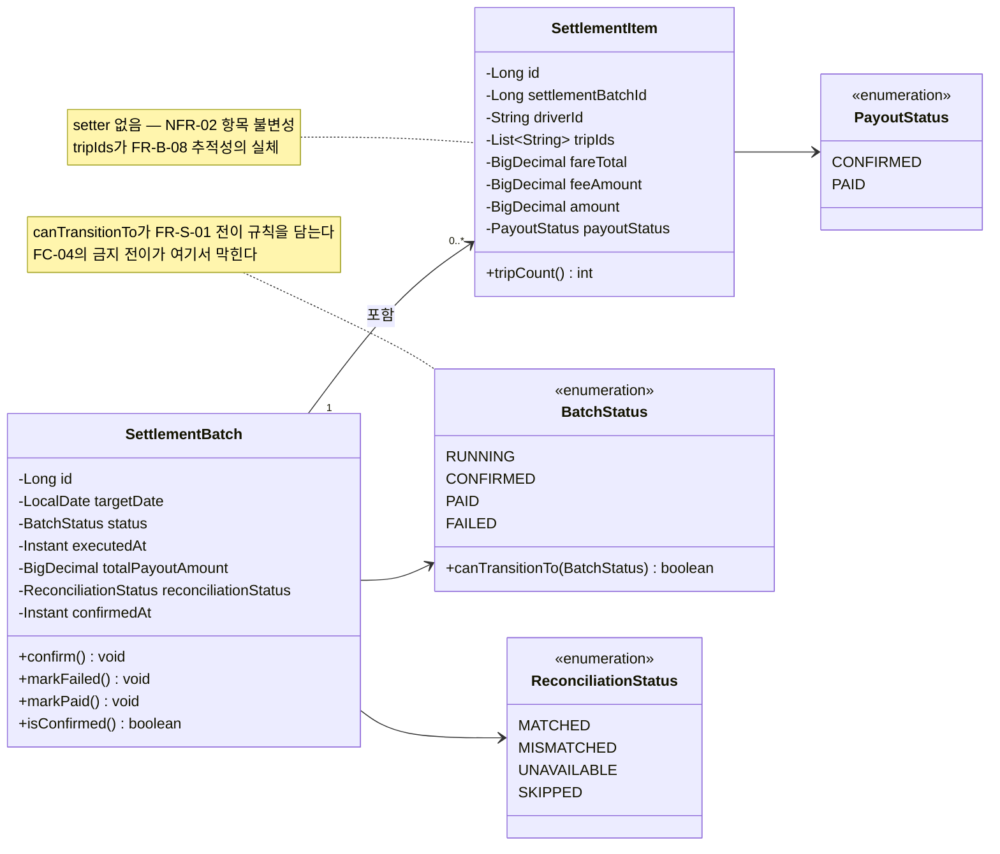

> [📚 문서 목록](../README.md) › [🧩 클래스 다이어그램](./index.html) › §2

# 🧱 도메인 계층

**설계 판단**

| # | 내용 |
|---|---|
| 1 | **`SettlementItem`에 setter를 두지 않는다.** 생성자로만 값을 채운다. `NFR-02`(확정 항목 불변)를 코드로 강제하는 방법이다 |
| 2 | **상태 전이 규칙을 `BatchStatus.canTransitionTo()`에 둔다.** Service에 `if` 문으로 흩어놓으면 [`FC-04`](../05-flow-chart/04-fc-04-state-transition.md)의 금지 전이 표가 코드 어디에 대응하는지 알 수 없게 된다 |
| 3 | `fareTotal`·`feeAmount`를 저장한다 — [정의서 §6.2](../02-requirements-specification/05-data-requirements.md) 제안. 🚧 `schema` 이슈 대상 |
| 4 | `SettlementBatch`는 `SettlementItem`을 JPA 연관으로 물지 않고 `settlementBatchId`(Long)로만 참조하는 편을 권한다. 배치가 수천 건의 항목을 로딩할 이유가 없다 |
| 5 | 🚧 `List~String~ tripIds` 매핑 방식은 [정의서 §6.2](../02-requirements-specification/05-data-requirements.md)의 3가지 선택지(배열/JSONB · 매핑 테이블 · 콤마 문자열) 중 미확정 (U10) |

---

**이전** → [계층 의존 관계](./01-layer-dependencies.md) · **다음** → [배치 계층](./03-batch-layer.md)
