> [📚 문서 목록](../README.md) › [🧩 클래스 다이어그램](./index.html) › §3

# ⚙️ 배치 계층

```mermaid
classDiagram
    direction TB

    class DailySettlementJobConfig {
        <<Configuration>>
        +dailySettlementJob(JobRepository) Job
        +settlementStep(JobRepository) Step
        +int CHUNK_SIZE
    }

    class DuplicateBatchGuard {
        <<Component>>
        -SettlementBatchRepository batchRepository
        +assertNotConfirmed(LocalDate) void
    }

    class PaymentItemReader {
        <<Component>>
        -PaymentClient paymentClient
        -LocalDate targetDate
        +read() PaymentSummary
    }

    class DriverSettlementProcessor {
        <<Component>>
        -BigDecimal feeRate
        +process(PaymentSummary) SettlementItem
        -isSettleable(PaymentSummary) boolean
        -calculateFee(BigDecimal) BigDecimal
    }

    class SettlementItemWriter {
        <<Component>>
        -SettlementItemRepository itemRepository
        +write(Chunk~SettlementItem~) void
    }

    class SettlementJobListener {
        <<Component>>
        -SettlementBatchRepository batchRepository
        -ReconciliationService reconciliationService
        +beforeJob(JobExecution) void
        +afterJob(JobExecution) void
    }

    class ItemReader {
        <<interface>>
    }
    class ItemProcessor {
        <<interface>>
    }
    class ItemWriter {
        <<interface>>
    }
    class JobExecutionListener {
        <<interface>>
    }

    ItemReader <|.. PaymentItemReader
    ItemProcessor <|.. DriverSettlementProcessor
    ItemWriter <|.. SettlementItemWriter
    JobExecutionListener <|.. SettlementJobListener

    DailySettlementJobConfig --> PaymentItemReader
    DailySettlementJobConfig --> DriverSettlementProcessor
    DailySettlementJobConfig --> SettlementItemWriter
    DailySettlementJobConfig --> SettlementJobListener
    DailySettlementJobConfig --> DuplicateBatchGuard

    note for DuplicateBatchGuard "FR-B-06 — Job 시작 전 검사<br/>애플리케이션 검사만으로는 동시 실행 경합을 막지 못한다<br/>DB 부분 UNIQUE 인덱스 병행 권장"
    note for DriverSettlementProcessor "FC-02 로직<br/>🚧 feeRate 하드코딩 vs 설정값 U4<br/>🚧 절사·반올림 규칙 U12"
    note for SettlementJobListener "NFR-06 로깅 · 상태 전이 · 대사 트리거"
```

**설계 판단**

| # | 내용 |
|---|---|
| 1 | **`DuplicateBatchGuard`를 별도 클래스로 뺐다.** `JobParametersValidator`로 구현할 수도 있으나, 이 검사는 파라미터 형식 검증이 아니라 **DB 상태 조회**다. 이름이 하는 일을 드러내는 편이 낫다 |
| 2 | **대사를 `afterJob`에서 트리거한다.** 모든 청크가 끝난 뒤 한 번 수행해야 하므로([`SD-01`](../04-sequence-diagram/01-sd-01-batch-normal-flow.md)), Step 안에 두면 청크마다 돌게 된다 |
| 3 | 🚧 `feeRate`를 상수로 둘지 `@Value` 설정값으로 뺄지 미확정 (U4). 필드로 그려둔 것은 **어느 쪽이든 이 위치**라는 뜻이며, 값의 출처를 확정한 것은 아니다 |
| 4 | `PaymentItemReader`는 `PaymentClient`만 의존한다. 🚧 페이지네이션(U3)이 확정되면 이 클래스 안에서 흡수되고 Job 구성은 바뀌지 않는다 |
| 5 | 🚧 `FR-B-09`(트리거)가 `@Scheduled`로 정해지면 `SettlementJobScheduler` 클래스가 추가된다. EventBridge면 추가 클래스 없이 외부에서 Job을 실행한다 — **이 선택이 클래스 하나의 존재를 좌우한다** |

---

**이전** → [도메인 계층](./02-domain-layer.md) · **다음** → [대사·조회 계층](./04-query-reconciliation-layer.md)
