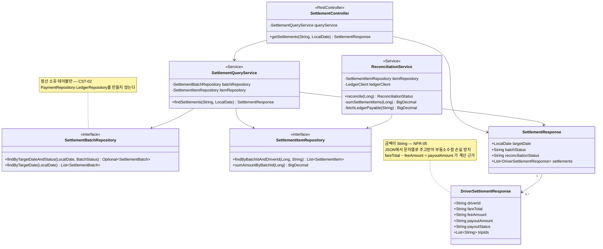

> [📚 문서 목록](../README.md) › [🧩 클래스 다이어그램](./index.html) › §4

# 🔍 대사·조회 계층

**설계 판단**

| # | 내용 |
|---|---|
| 1 | **DTO의 금액 필드가 `String`이다.** 내부는 `BigDecimal`, 경계에서 문자열로 변환한다 (`NFR-05`). `@JsonSerialize(using = ToStringSerializer.class)`로 처리해도 되지만, 타입을 `String`으로 두면 실수로 숫자로 내보낼 여지가 없다 |
| 2 | `ReconciliationService`가 조회 Service와 분리돼 있다. 대사는 배치가 부르고 조회는 Controller가 부른다 — 호출자와 생애가 다르다 |
| 3 | `sumAmountByBatchId`를 Repository의 집계 쿼리로 둔다. 항목을 전부 로딩해 애플리케이션에서 더하면 건수가 늘 때 메모리를 먹는다 |
| 4 | 🚧 `FR-Q-04` 페이지네이션이 확정되면 `SettlementController`·`SettlementQueryService` 시그니처에 `Pageable`이 추가된다 |

---

**이전** → [배치 계층](./03-batch-layer.md) · **다음** → [외부 연동 계층](./05-client-layer.md)
