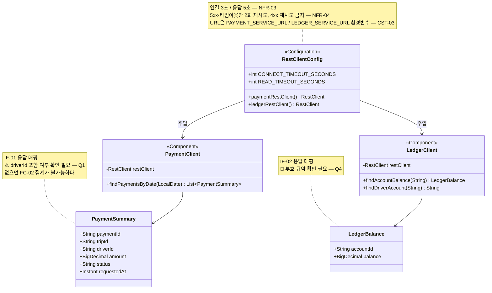

> [📚 문서 목록](../README.md) › [🧩 클래스 다이어그램](./index.html) › §5

# 🔗 외부 연동 계층

**설계 판단**

| # | 내용 |
|---|---|
| 1 | **`PaymentClient`·`LedgerClient`가 HTTP를 아는 유일한 지점이다.** `IF-01`~`IF-03`이 전부 🚧인 상황에서, 스펙이 바뀔 때 고칠 파일을 두 개로 한정한다 |
| 2 | `RestClientConfig`에 타임아웃·재시도·URL을 모은다. 🔒 URL은 환경변수로만 주입하고 코드에 값을 쓰지 않는다 (`CST-03`, `CST-04`) |
| 3 | `LedgerClient.findDriverAccount()`는 🚧 [`IF-02` Q3](../02-requirements-specification/04-external-interfaces.md)에 달려 있다. `driverId`로 잔액을 바로 조회할 수 있으면 이 메서드는 사라진다 |
| 4 | 🚧 U8을 "지급 분개 기록한다"로 정하면 `LedgerClient.recordPayoutEntries()`가 추가된다 ([`SD-06`](../04-sequence-diagram/06-sd-06-payout-ledger-entry.md)). 정하지 않으면 추가하지 않는다 |
| 5 | `PaymentSummary`는 결제 서버 응답의 **정산이 필요한 필드만** 담는다. 결제 서버의 전체 응답을 그대로 받는 클래스를 만들면 결제 스키마 변경이 정산으로 그대로 번진다 |

---

**이전** → [대사·조회 계층](./04-query-reconciliation-layer.md) · **다음** → [예외 계층](./06-exception-layer.md)
