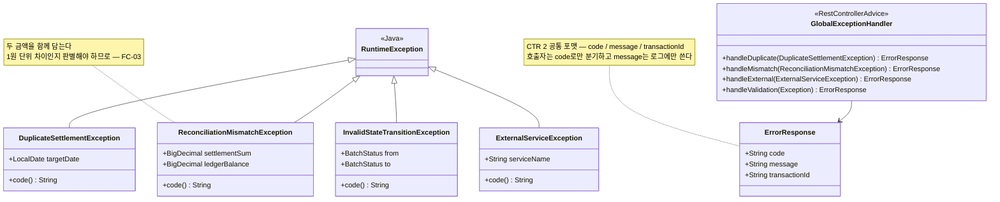

> [📚 문서 목록](../README.md) › [🧩 클래스 다이어그램](./index.html) › §6

# ⛔ 예외 계층

**설계 판단**

| # | 내용 |
|---|---|
| 1 | 각 예외가 `code()`를 갖는다. 에러 코드가 예외 클래스와 1:1로 대응해 [정의서 §7 에러 코드](../02-requirements-specification/06-error-codes.md) 표와 코드가 어긋나지 않는다 |
| 2 | **`ReconciliationMismatchException`이 두 금액을 함께 담는다.** [`FC-03`](../05-flow-chart/03-fc-03-reconciliation-decision.md)에서 1원 단위 차이(U12 의심)와 실제 불일치를 구별해야 하므로, 메시지 문자열만으로는 부족하다 |
| 3 | `ExternalServiceException`에 `serviceName`을 둬 `PAYMENT_SERVICE_UNAVAILABLE`과 `LEDGER_SERVICE_UNAVAILABLE`을 한 클래스로 처리한다 |

---

**이전** → [외부 연동 계층](./05-client-layer.md) · **다음** → [클래스별 책임](./07-class-responsibilities.md)
